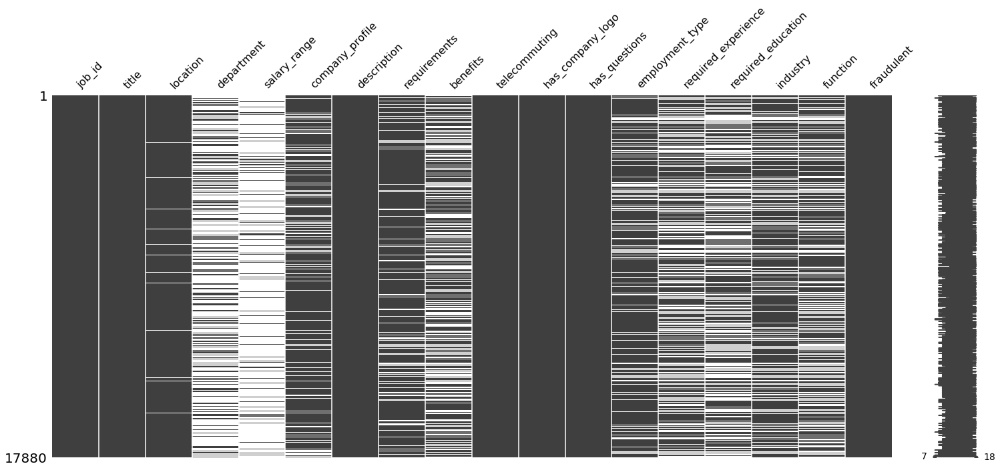
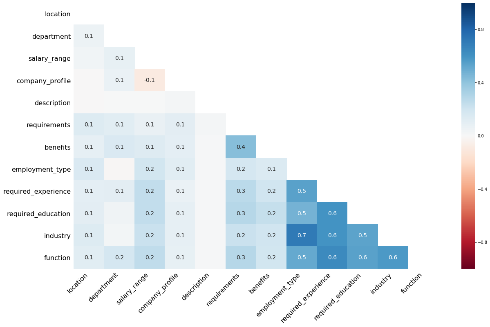
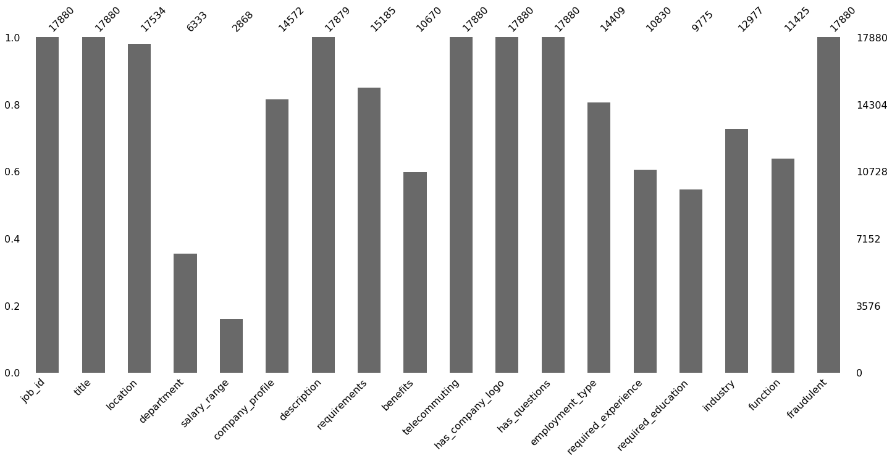
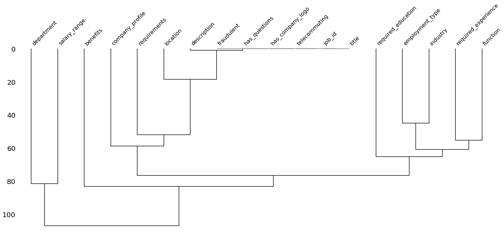

# Data Visualization
[<-  Back to Home](../../README.md)

```python
import pandas as pd
import numpy as np
from plotly import express as px
from matplotlib import pyplot as plt
import missingno as msn
import seaborn as sns
%matplotlib inline
```

## Reading File


```python
df = pd.read_csv("fake_job_postings.csv")
df.head(2)
```


<div>
<style scoped>
    .dataframe tbody tr th:only-of-type {
        vertical-align: middle;
    }

    .dataframe tbody tr th {
        vertical-align: top;
    }

    .dataframe thead th {
        text-align: right;
    }
</style>
<table border="1" class="dataframe">
  <thead>
    <tr style="text-align: right;">
      <th></th>
      <th>job_id</th>
      <th>title</th>
      <th>location</th>
      <th>department</th>
      <th>salary_range</th>
      <th>company_profile</th>
      <th>description</th>
      <th>requirements</th>
      <th>benefits</th>
      <th>telecommuting</th>
      <th>has_company_logo</th>
      <th>has_questions</th>
      <th>employment_type</th>
      <th>required_experience</th>
      <th>required_education</th>
      <th>industry</th>
      <th>function</th>
      <th>fraudulent</th>
    </tr>
  </thead>
  <tbody>
    <tr>
      <th>0</th>
      <td>1</td>
      <td>Marketing Intern</td>
      <td>US, NY, New York</td>
      <td>Marketing</td>
      <td>NaN</td>
      <td>We're Food52, and we've created a groundbreaki...</td>
      <td>Food52, a fast-growing, James Beard Award-winn...</td>
      <td>Experience with content management systems a m...</td>
      <td>NaN</td>
      <td>0</td>
      <td>1</td>
      <td>0</td>
      <td>Other</td>
      <td>Internship</td>
      <td>NaN</td>
      <td>NaN</td>
      <td>Marketing</td>
      <td>0</td>
    </tr>
    <tr>
      <th>1</th>
      <td>2</td>
      <td>Customer Service - Cloud Video Production</td>
      <td>NZ, , Auckland</td>
      <td>Success</td>
      <td>NaN</td>
      <td>90 Seconds, the worlds Cloud Video Production ...</td>
      <td>Organised - Focused - Vibrant - Awesome!Do you...</td>
      <td>What we expect from you:Your key responsibilit...</td>
      <td>What you will get from usThrough being part of...</td>
      <td>0</td>
      <td>1</td>
      <td>0</td>
      <td>Full-time</td>
      <td>Not Applicable</td>
      <td>NaN</td>
      <td>Marketing and Advertising</td>
      <td>Customer Service</td>
      <td>0</td>
    </tr>
  </tbody>
</table>
</div>


```python
print(df.columns)
```

    Index(['job_id', 'title', 'location', 'department', 'salary_range',
           'company_profile', 'description', 'requirements', 'benefits',
           'telecommuting', 'has_company_logo', 'has_questions', 'employment_type',
           'required_experience', 'required_education', 'industry', 'function',
           'fraudulent'],
          dtype='object')


**Question 1 ::** How many Datapoints are present in the data?

**Question 2 ::** How many Features are present in the data?


```python
print("sol1:- Total Number Of DataPoints:- {}.".format(df.shape[0]))
print("sol2:- Total Number of features:- {}.".format(df.shape[1]))
```

    sol1:- Total Number Of DataPoints:- 17880.
    sol2:- Total Number of features:- 18.


**Question 3 ::** check for null values ?


```python
df.info()
```

    <class 'pandas.core.frame.DataFrame'>
    RangeIndex: 17880 entries, 0 to 17879
    Data columns (total 18 columns):
    job_id                 17880 non-null int64
    title                  17880 non-null object
    location               17534 non-null object
    department             6333 non-null object
    salary_range           2868 non-null object
    company_profile        14572 non-null object
    description            17879 non-null object
    requirements           15185 non-null object
    benefits               10670 non-null object
    telecommuting          17880 non-null int64
    has_company_logo       17880 non-null int64
    has_questions          17880 non-null int64
    employment_type        14409 non-null object
    required_experience    10830 non-null object
    required_education     9775 non-null object
    industry               12977 non-null object
    function               11425 non-null object
    fraudulent             17880 non-null int64
    dtypes: int64(5), object(13)
    memory usage: 2.5+ MB


```python
msn.matrix(df)
```


    <matplotlib.axes._subplots.AxesSubplot at 0x7f78397e4208>





```python
msn.heatmap(df)
```


    <matplotlib.axes._subplots.AxesSubplot at 0x7f7833f10780>





```python
msn.bar(df)
```


    <matplotlib.axes._subplots.AxesSubplot at 0x7f783a141940>





```python
for item in df.columns:
    print("{} uniques: {}".format(item,df[item].unique().size))
```

    job_id uniques: 17880
    title uniques: 11231
    location uniques: 3106
    department uniques: 1338
    salary_range uniques: 875
    company_profile uniques: 1710
    description uniques: 14802
    requirements uniques: 11969
    benefits uniques: 6206
    telecommuting uniques: 2
    has_company_logo uniques: 2
    has_questions uniques: 2
    employment_type uniques: 6
    required_experience uniques: 8
    required_education uniques: 14
    industry uniques: 132
    function uniques: 38
    fraudulent uniques: 2


## Features:- 
* job_id: - Every job have a different id
* title:-  Job have a title
* location:- Location of job
* department:- Job department(ex:- marketing etc)
* salary_range:- range of salary
* company_profile:- what actually campany do like it is food company or tech company.
* description :- Full descripton of job
* requirements :- What are the Requirements
* benefits:- What are the extra benifit
* Telecommuting:- binary variable 
* has_company_logo:- binary variable
* has_questions:- binary variable 
* employment_type:- full-time or part time 
* required_experience:- internship of how much experience needed
* required_education:- Minimum qualification  
* industry:- Ex-marketing and advrtisement
* function:- functionality of job
* fraudulent:- it is fraud or not

**Question 4 ::** How many datapoints Are Fraudent in the given data ?


```python
print("sol :: Number Of Fraudent job :: {}".format(df['fraudulent'].mean() * df['fraudulent'].size))
```

    sol :: Number Of Fraudent job :: 866.0


```python
msn.dendrogram(df)
```


    <matplotlib.axes._subplots.AxesSubplot at 0x7f783a2177b8>




