# Data Visualization
[<-  Back to Home](../../README.md)

## Tools Needed
```python
import pandas as pd
import numpy as np
import matplotlib.pyplot as plt
import bokeh as bh
from textblob import TextBlob
import plotly.graph_objects as go
```


```python
df = pd.read_csv("WomensClothingECommerceReviews.csv")
```


```python
df.head()
```


<div>
<style scoped>
    .dataframe tbody tr th:only-of-type {
        vertical-align: middle;
    }

    .dataframe tbody tr th {
        vertical-align: top;
    }

    .dataframe thead th {
        text-align: right;
    }
</style>
<table border="1" class="dataframe">
  <thead>
    <tr style="text-align: right;">
      <th></th>
      <th>Unnamed: 0</th>
      <th>Clothing ID</th>
      <th>Age</th>
      <th>Title</th>
      <th>Review Text</th>
      <th>Rating</th>
      <th>Recommended IND</th>
      <th>Positive Feedback Count</th>
      <th>Division Name</th>
      <th>Department Name</th>
      <th>Class Name</th>
    </tr>
  </thead>
  <tbody>
    <tr>
      <th>0</th>
      <td>0</td>
      <td>767</td>
      <td>33</td>
      <td>NaN</td>
      <td>Absolutely wonderful - silky and sexy and comf...</td>
      <td>4</td>
      <td>1</td>
      <td>0</td>
      <td>Initmates</td>
      <td>Intimate</td>
      <td>Intimates</td>
    </tr>
    <tr>
      <th>1</th>
      <td>1</td>
      <td>1080</td>
      <td>34</td>
      <td>NaN</td>
      <td>Love this dress!  it's sooo pretty.  i happene...</td>
      <td>5</td>
      <td>1</td>
      <td>4</td>
      <td>General</td>
      <td>Dresses</td>
      <td>Dresses</td>
    </tr>
    <tr>
      <th>2</th>
      <td>2</td>
      <td>1077</td>
      <td>60</td>
      <td>Some major design flaws</td>
      <td>I had such high hopes for this dress and reall...</td>
      <td>3</td>
      <td>0</td>
      <td>0</td>
      <td>General</td>
      <td>Dresses</td>
      <td>Dresses</td>
    </tr>
    <tr>
      <th>3</th>
      <td>3</td>
      <td>1049</td>
      <td>50</td>
      <td>My favorite buy!</td>
      <td>I love, love, love this jumpsuit. it's fun, fl...</td>
      <td>5</td>
      <td>1</td>
      <td>0</td>
      <td>General Petite</td>
      <td>Bottoms</td>
      <td>Pants</td>
    </tr>
    <tr>
      <th>4</th>
      <td>4</td>
      <td>847</td>
      <td>47</td>
      <td>Flattering shirt</td>
      <td>This shirt is very flattering to all due to th...</td>
      <td>5</td>
      <td>1</td>
      <td>6</td>
      <td>General</td>
      <td>Tops</td>
      <td>Blouses</td>
    </tr>
  </tbody>
</table>
</div>


```python
print(df.info())
```

    <class 'pandas.core.frame.DataFrame'>
    RangeIndex: 23486 entries, 0 to 23485
    Data columns (total 11 columns):
    Unnamed: 0                 23486 non-null int64
    Clothing ID                23486 non-null int64
    Age                        23486 non-null int64
    Title                      19676 non-null object
    Review Text                22641 non-null object
    Rating                     23486 non-null int64
    Recommended IND            23486 non-null int64
    Positive Feedback Count    23486 non-null int64
    Division Name              23472 non-null object
    Department Name            23472 non-null object
    Class Name                 23472 non-null object
    dtypes: int64(6), object(5)
    memory usage: 2.0+ MB
    None


* Remove the "Title feature"
* Remove the row where "Review Text" were missing
* clean "Review Text" column.
* Using TextBlob to calculate sentiment polarity which lies in the range of [-1,1] where 1 means positive sentiment and -1 means negative sentiment.
* create new feature for the length of the review
* create new feature for the word count of the review.


```python
df.shape
```


    (23486, 11)


```python
df.head()
```


<div>
<style scoped>
    .dataframe tbody tr th:only-of-type {
        vertical-align: middle;
    }

    .dataframe tbody tr th {
        vertical-align: top;
    }

    .dataframe thead th {
        text-align: right;
    }
</style>
<table border="1" class="dataframe">
  <thead>
    <tr style="text-align: right;">
      <th></th>
      <th>Unnamed: 0</th>
      <th>Clothing ID</th>
      <th>Age</th>
      <th>Title</th>
      <th>Review Text</th>
      <th>Rating</th>
      <th>Recommended IND</th>
      <th>Positive Feedback Count</th>
      <th>Division Name</th>
      <th>Department Name</th>
      <th>Class Name</th>
    </tr>
  </thead>
  <tbody>
    <tr>
      <th>0</th>
      <td>0</td>
      <td>767</td>
      <td>33</td>
      <td>NaN</td>
      <td>Absolutely wonderful - silky and sexy and comf...</td>
      <td>4</td>
      <td>1</td>
      <td>0</td>
      <td>Initmates</td>
      <td>Intimate</td>
      <td>Intimates</td>
    </tr>
    <tr>
      <th>1</th>
      <td>1</td>
      <td>1080</td>
      <td>34</td>
      <td>NaN</td>
      <td>Love this dress!  it's sooo pretty.  i happene...</td>
      <td>5</td>
      <td>1</td>
      <td>4</td>
      <td>General</td>
      <td>Dresses</td>
      <td>Dresses</td>
    </tr>
    <tr>
      <th>2</th>
      <td>2</td>
      <td>1077</td>
      <td>60</td>
      <td>Some major design flaws</td>
      <td>I had such high hopes for this dress and reall...</td>
      <td>3</td>
      <td>0</td>
      <td>0</td>
      <td>General</td>
      <td>Dresses</td>
      <td>Dresses</td>
    </tr>
    <tr>
      <th>3</th>
      <td>3</td>
      <td>1049</td>
      <td>50</td>
      <td>My favorite buy!</td>
      <td>I love, love, love this jumpsuit. it's fun, fl...</td>
      <td>5</td>
      <td>1</td>
      <td>0</td>
      <td>General Petite</td>
      <td>Bottoms</td>
      <td>Pants</td>
    </tr>
    <tr>
      <th>4</th>
      <td>4</td>
      <td>847</td>
      <td>47</td>
      <td>Flattering shirt</td>
      <td>This shirt is very flattering to all due to th...</td>
      <td>5</td>
      <td>1</td>
      <td>6</td>
      <td>General</td>
      <td>Tops</td>
      <td>Blouses</td>
    </tr>
  </tbody>
</table>
</div>


```python
#drop unnamed and title
df = pd.read_csv("WomensClothingECommerceReviews.csv")
def dropColumn(DataFrame,columnNameList):
    '''This Function Take Two Arguments:
            1 ->> DataFrame(pandas dataframe) from which you want to delete the column
            2 ->> Column name List
        returns True success
    '''
    for col in columnNameList:
        DataFrame.drop(col,axis=1,inplace=True)
        print("{} sucessFully Deleted".format(col))
        
    return True


#f.drop('Unnamed: 0',axis =1,inplace=True)
#f.drop('Title',axis=1,inplace=True)
df.head(2)
```


<div>
<style scoped>
    .dataframe tbody tr th:only-of-type {
        vertical-align: middle;
    }

    .dataframe tbody tr th {
        vertical-align: top;
    }

    .dataframe thead th {
        text-align: right;
    }
</style>
<table border="1" class="dataframe">
  <thead>
    <tr style="text-align: right;">
      <th></th>
      <th>Unnamed: 0</th>
      <th>Clothing ID</th>
      <th>Age</th>
      <th>Title</th>
      <th>Review Text</th>
      <th>Rating</th>
      <th>Recommended IND</th>
      <th>Positive Feedback Count</th>
      <th>Division Name</th>
      <th>Department Name</th>
      <th>Class Name</th>
    </tr>
  </thead>
  <tbody>
    <tr>
      <th>0</th>
      <td>0</td>
      <td>767</td>
      <td>33</td>
      <td>NaN</td>
      <td>Absolutely wonderful - silky and sexy and comf...</td>
      <td>4</td>
      <td>1</td>
      <td>0</td>
      <td>Initmates</td>
      <td>Intimate</td>
      <td>Intimates</td>
    </tr>
    <tr>
      <th>1</th>
      <td>1</td>
      <td>1080</td>
      <td>34</td>
      <td>NaN</td>
      <td>Love this dress!  it's sooo pretty.  i happene...</td>
      <td>5</td>
      <td>1</td>
      <td>4</td>
      <td>General</td>
      <td>Dresses</td>
      <td>Dresses</td>
    </tr>
  </tbody>
</table>
</div>


```python
help(dropColumn)
dropColumn(df,["Unnamed: 0","Title"])
```

    Help on function dropColumn in module __main__:
    
    dropColumn(DataFrame, columnNameList)
        This Function Take Two Arguments:
            1 ->> DataFrame(pandas dataframe) from which you want to delete the column
            2 ->> Column name List
        returns True success
    
    Unnamed: 0 sucessFully Deleted
    Title sucessFully Deleted


    True


```python
df = df[~df['Review Text'].isnull()]
print(df.shape)
```

    (22641, 9)


```python
def preprocess(ReviewText):
    ReviewText = ReviewText.str.replace("(<br/>)","")
    ReviewText = ReviewText.str.replace("(<a).*(>)","")
    ReviewText = ReviewText.str.replace("(&amp)","")
    ReviewText = ReviewText.str.replace("(&gt)","")
    ReviewText = ReviewText.str.replace("(&lt)","")
    ReviewText = ReviewText.str.replace("(\xa0)"," ")
    return ReviewText
```


```python
TextBlob("i  am good").sentiment.polarity
text = "i am divay"
len(text.split())
```


    3


```python
df['Review Text'] = preprocess(df["Review Text"])
df['polarity'] = df['Review Text'].map(lambda text:TextBlob(text).sentiment.polarity)
df['word_count'] = df['Review Text'].map(lambda text:len(text.split()))
df['review_len'] = df['Review Text'].astype(str).apply(len)
```


```python
df.head(2)
```


<div>
<style scoped>
    .dataframe tbody tr th:only-of-type {
        vertical-align: middle;
    }

    .dataframe tbody tr th {
        vertical-align: top;
    }

    .dataframe thead th {
        text-align: right;
    }
</style>
<table border="1" class="dataframe">
  <thead>
    <tr style="text-align: right;">
      <th></th>
      <th>Clothing ID</th>
      <th>Age</th>
      <th>Review Text</th>
      <th>Rating</th>
      <th>Recommended IND</th>
      <th>Positive Feedback Count</th>
      <th>Division Name</th>
      <th>Department Name</th>
      <th>Class Name</th>
      <th>polarity</th>
      <th>word_count</th>
      <th>review_len</th>
    </tr>
  </thead>
  <tbody>
    <tr>
      <th>0</th>
      <td>767</td>
      <td>33</td>
      <td>Absolutely wonderful - silky and sexy and comf...</td>
      <td>4</td>
      <td>1</td>
      <td>0</td>
      <td>Initmates</td>
      <td>Intimate</td>
      <td>Intimates</td>
      <td>0.633333</td>
      <td>8</td>
      <td>53</td>
    </tr>
    <tr>
      <th>1</th>
      <td>1080</td>
      <td>34</td>
      <td>Love this dress!  it's sooo pretty.  i happene...</td>
      <td>5</td>
      <td>1</td>
      <td>4</td>
      <td>General</td>
      <td>Dresses</td>
      <td>Dresses</td>
      <td>0.339583</td>
      <td>62</td>
      <td>303</td>
    </tr>
  </tbody>
</table>
</div>


```python
print('5 random reviews with the highest positive sentiment polarity: \n')
cl = df.loc[df.polarity==1,["Review Text"]].sample(5).values
for c in cl:
    print(c[0])

```

    5 random reviews with the highest positive sentiment polarity: 
    
    This is the perfect holiday dress. my best purchase of the season!
    The print is awesome !
    This is a great blouse for all shapes!   you can wear it under a suit or with jeans!
    Fits perfect.
    So beautiful! i got the xs and it fits tts! it goes with everything! perfect weekend addition!


```python
print('5 random reviews with the nutral sentiment polarity: \n')
cl = df.loc[df.polarity==0,["Review Text"]].sample(5).values
for c in cl:
    print(c[0])

```

    5 random reviews with the nutral sentiment polarity: 
    
    Just received pants and even though they are labeled "petite" they are not. the inseam is 28 for a waist size 26, which is not what the description states.
    I like the tunic but there are no care instructions in the garment. if i wash it once and it shrinks or the dye runs it will be going back. please send care instructions.
    These shorts are divine. the fabric is sturdy and there is a weave of sparkle that i did not perceive from the picture.
    I bought this shirt along with a matching vest and duster........love it!
    The print doesn't necessarily works for everybody.


```python
print('5 random reviews with the highest negative sentiment polarity: \n')
cl = df.loc[df.polarity==-0.97500000000000009,["Review Text"]].sample(1).values
for c in cl:
    print(c[0])

```

    5 random reviews with the highest negative sentiment polarity: 
    
    Received this product with a gaping hole in it. very disappointed in the quality and the quality control at the warehouse


## Univariate Visualization


```python
df['polarity'].plot(
    kind = 'hist',
    grid=True,
    colormap='spring',
    legend=True,
    x = "polarity",
    y="count",
    bins = 50,
    title='sentiment Polarity Distribution'
    
    
)
```


    <matplotlib.axes._subplots.AxesSubplot at 0x7f7d53f82358>


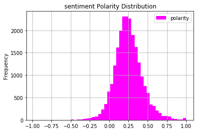


```python
#anather method to draw histogram 
df['polarity'].plot.hist(bins=50,
                         alpha=0.5,
                         grid=True,
                         colormap='spring'
                        )
```


    <matplotlib.axes._subplots.AxesSubplot at 0x7f7d52f091d0>


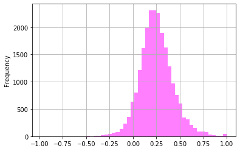


```python
x = df['polarity'].plot(
    kind = 'hist',
    grid=True,
    colormap='spring',
    legend=True,
    bins = 100,
    title='sentiment Polarity Distribution'
)
x.set_xlabel("Polarity", labelpad=20, weight='bold', size=12)
x.set_ylabel("count", labelpad=20, weight='bold', size=12)

   

```


    Text(0, 0.5, 'count')


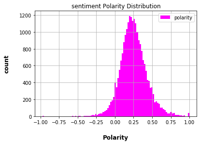


```python
ax = df['Rating'].plot(
    kind = 'hist',
    colormap = 'spring',
    grid = "true",
    title = "Review Rating Distribution"
    )
ax.set_xlabel("Rating", labelpad=20, weight='bold', size=12)
ax.set_ylabel("count", labelpad=20, weight='bold', size=12)
```


    Text(0, 0.5, 'count')


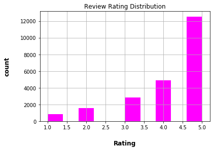


```python
ax = df['Age'].plot(
    kind="hist",
    grid = "true",
    colormap = "spring",
    bins = 50,
    title = 'Review age distribution'
)
ax.set_xlabel("age", labelpad=20, weight='bold', size=12)
ax.set_ylabel("count", labelpad=20, weight='bold', size=12)

```


    Text(0, 0.5, 'count')


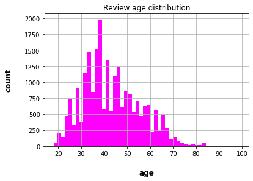


```python
ax = df['review_len'].plot(
    kind="hist",
    grid = "true",
    colormap = "spring",
    bins = 50,
    title = 'Review review_len distribution'
)
ax.set_xlabel("review_len", labelpad=20, weight='bold', size=12)
ax.set_ylabel("count", labelpad=20, weight='bold', size=12)

```


    Text(0, 0.5, 'count')


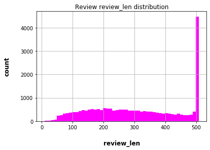


```python
ax = df['word_count'].plot(
    kind="hist",
    grid = "true",
    colormap = "spring",
    bins = 50,
    title = 'Review review_len distribution'
)
ax.set_xlabel("word_count", labelpad=20, weight='bold', size=12)
ax.set_ylabel("count", labelpad=20, weight='bold', size=12)

```


    Text(0, 0.5, 'count')


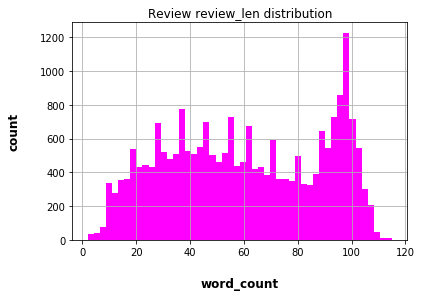


```python
ax = df.groupby('Division Name').count()['Clothing ID'].plot(
    kind="bar",
    colormap="spring"
)
ax.set_xlabel("Division Name",labelpad=20,weight='bold',size=12)
ax.set_ylabel("Count",labelpad=20,weight='bold',size=12)
```


    Text(0, 0.5, 'Count')


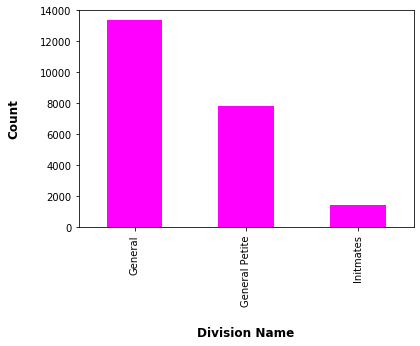


```python
ax = df.groupby('Department Name').count()['Clothing ID'].sort_values(ascending=False).plot(
    kind = 'bar',
    colormap = 'spring',
    title = 'Bar chart pf Department name'
)
ax.set_xlabel("Department Name",labelpad=20,weight='bold',size=12)
ax.set_ylabel("count",labelpad=20,weight='bold',size=12)
```


    Text(0, 0.5, 'count')


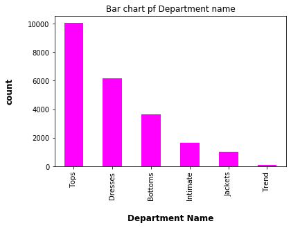


```python
ax = df.groupby('Class Name').count()['Clothing ID'].sort_values(ascending=False).plot(
    kind='bar',
    colormap='spring',
    title='Bar Chart Class Name',
    legend = True
)
ax.set_xlabel("class name",labelpad=20,weight='bold',size=12)
ax.set_ylabel("count",labelpad=20,weight='bold',size=12)

```


    Text(0, 0.5, 'count')


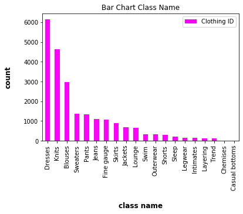


### N gram visualization


```python
from sklearn.feature_extraction.text import CountVectorizer
```


```python
from nltk.corpus import stopwords
def get_top_n_words(corpus,n = None):
    vec = CountVectorizer().fit(corpus)
    bag_of_words = vec.transform(corpus)
    sum_words = bag_of_words.sum(axis=0)
    word_freq = [(word,sum_words[0,idx]) for word,idx in vec.vocabulary_.items()]
    word_freq = sorted(word_freq,key=lambda x: x[1],reverse=True)
    return word_freq[:n]

def get_top_n_words_withoutStopWords(corpus,n = None):
    vec = CountVectorizer(stop_words = 'english').fit(corpus)
    bag_of_words = vec.transform(corpus)
    sum_words = bag_of_words.sum(axis=0)
    word_freq = [(word,sum_words[0,idx]) for word,idx in vec.vocabulary_.items()]
    word_freq = sorted(word_freq,key=lambda x: x[1],reverse=True)
    return word_freq[:n]
def get_top_n_words_twoGram(corpus,n = None):
    vec = CountVectorizer( ngram_range=(2,2)).fit(corpus)
    bag_of_words = vec.transform(corpus)
    sum_words = bag_of_words.sum(axis=0)
    word_freq = [(word,sum_words[0,idx]) for word,idx in vec.vocabulary_.items()]
    word_freq = sorted(word_freq,key=lambda x: x[1],reverse=True)
    return word_freq[:n]
def get_top_n_words_twoGram_withoutStopWords(corpus,n = None):
    vec = CountVectorizer( ngram_range=(2,2),stop_words='english').fit(corpus)
    bag_of_words = vec.transform(corpus)
    sum_words = bag_of_words.sum(axis=0)
    word_freq = [(word,sum_words[0,idx]) for word,idx in vec.vocabulary_.items()]
    word_freq = sorted(word_freq,key=lambda x: x[1],reverse=True)
    return word_freq[:n]
def get_top_n_words_triGram(corpus,n = None):
    vec = CountVectorizer( ngram_range=(3,3)).fit(corpus)
    bag_of_words = vec.transform(corpus)
    sum_words = bag_of_words.sum(axis=0)
    word_freq = [(word,sum_words[0,idx]) for word,idx in vec.vocabulary_.items()]
    word_freq = sorted(word_freq,key=lambda x: x[1],reverse=True)
    return word_freq[:n]
def get_top_n_words_triGram_withoutStopWords(corpus,n = None):
    vec = CountVectorizer( ngram_range=(3,3),stop_words='english').fit(corpus)
    bag_of_words = vec.transform(corpus)
    sum_words = bag_of_words.sum(axis=0)
    word_freq = [(word,sum_words[0,idx]) for word,idx in vec.vocabulary_.items()]
    word_freq = sorted(word_freq,key=lambda x: x[1],reverse=True)
    return word_freq[:n]
```


```python

```


```python
common_words = get_top_n_words(df['Review Text'],20)
for words,count in common_words:
    print(words,count)
```

    the 76166
    it 49284
    and 49009
    is 30641
    this 25762
    to 24583
    in 20723
    but 16556
    on 15328
    for 14000
    of 13429
    with 12803
    was 12221
    so 12023
    my 11028
    dress 10567
    that 10014
    not 9799
    love 8951
    size 8772


```python
df1 = pd.DataFrame(common_words, columns=['ReviewText','count'])
ax = df1.groupby('ReviewText').sum()['count'].sort_values(ascending=True).plot(
    kind="bar",
    title = "Top 20 words",
    colormap = "spring"
)
ax.set_xlabel("Words",labelpad = 20,weight='bold',size=12)
ax.set_ylabel("count",labelpad = 20,weight='bold',size=12)
```


    Text(0, 0.5, 'count')


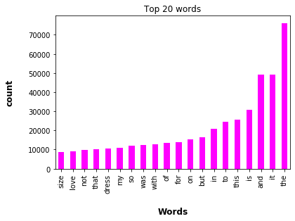


```python
common_words = get_top_n_words_withoutStopWords(df['Review Text'],20)
df1 = pd.DataFrame(common_words, columns=['ReviewText','count'])
ax = df1.groupby('ReviewText').sum()['count'].sort_values(ascending=True).plot(
    kind="bar",
    title = "Top 20 words",
    colormap = "spring"
)
ax.set_xlabel("Words",labelpad = 20,weight='bold',size=12)
ax.set_ylabel("count",labelpad = 20,weight='bold',size=12)
```


    Text(0, 0.5, 'count')


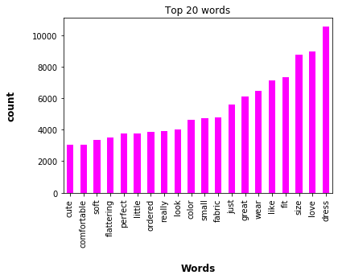


```python
common_words = get_top_n_words_twoGram(df['Review Text'],20)
df1 = pd.DataFrame(common_words, columns=['ReviewText','count'])
ax = df1.groupby('ReviewText').sum()['count'].sort_values(ascending=True).plot(
    kind="bar",
    title = "Top 20 words",
    colormap = "spring"
)
ax.set_xlabel("Words",labelpad = 20,weight='bold',size=12)
ax.set_ylabel("count",labelpad = 20,weight='bold',size=12)
```


    Text(0, 0.5, 'count')


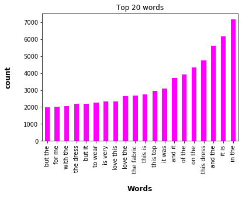


```python
common_words = get_top_n_words_twoGram_withoutStopWords(df['Review Text'],20)
df1 = pd.DataFrame(common_words, columns=['ReviewText','count'])
ax = df1.groupby('ReviewText').sum()['count'].sort_values(ascending=True).plot(
    kind="bar",
    title = "Top 20 words",
    colormap = "spring"
)
ax.set_xlabel("Words",labelpad = 20,weight='bold',size=12)
ax.set_ylabel("count",labelpad = 20,weight='bold',size=12)
```


    Text(0, 0.5, 'count')


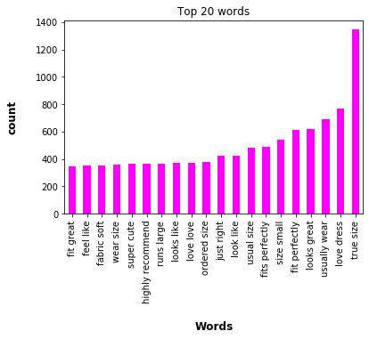


```python
common_words = get_top_n_words_triGram(df['Review Text'],20)
df1 = pd.DataFrame(common_words, columns=['ReviewText','count'])
ax = df1.groupby('ReviewText').sum()['count'].sort_values(ascending=True).plot(
    kind="bar",
    title = "Top 20 words",
    colormap = "spring"
)
ax.set_xlabel("Words",labelpad = 20,weight='bold',size=12)
ax.set_ylabel("count",labelpad = 20,weight='bold',size=12)
```


    Text(0, 0.5, 'count')


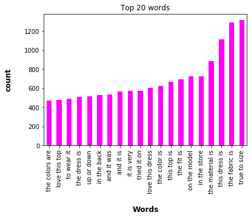


```python
common_words = get_top_n_words_triGram_withoutStopWords(df['Review Text'],20)
df1 = pd.DataFrame(common_words, columns=['ReviewText','count'])
ax = df1.groupby('ReviewText').sum()['count'].sort_values(ascending=True).plot(
    kind="bar",
    title = "Top 20 words",
    colormap = "spring"
)
ax.set_xlabel("Words",labelpad = 20,weight='bold',size=12)
ax.set_ylabel("count",labelpad = 20,weight='bold',size=12)
```


    Text(0, 0.5, 'count')


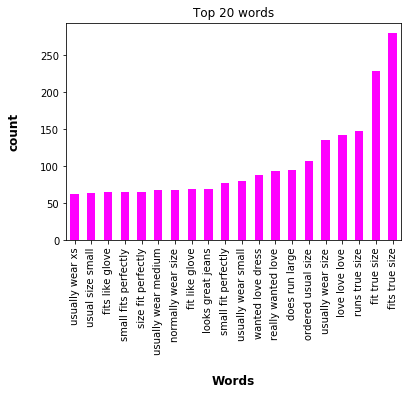


# POS TAGs


```python
blob = TextBlob(str(df['Review Text']))
pos_df = pd.DataFrame(blob.tags,columns=['words','pos'])
pos_df = pos_df.pos.value_counts()[:20]
```


```python
pos_df.head(2)
```


    NN    131
    DT     88
    Name: pos, dtype: int64


```python
ax = pos_df.plot(
    kind = 'bar',
    title = 'Bar Graph For Tags',
    colormap = "spring"
)
ax.set_xlabel("Tags",labelpad = 20,weight='bold',size =12)
ax.set_ylabel("Count",labelpad=20,weight='bold',size=12)
```


    Text(0, 0.5, 'Count')


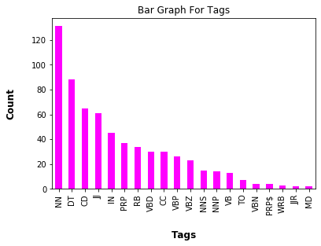

